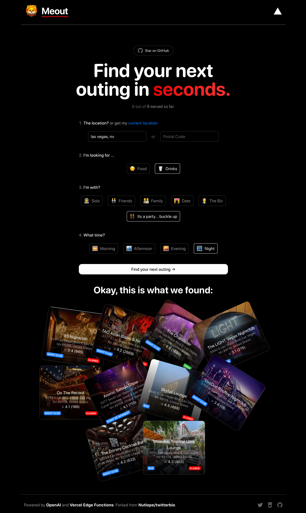

# [Meout.app](https://www.meout.app/)

This project generates a list of outings (restaurants, bars, cafes, etc.) for you using AI.

[](https://meout.app)

## How it works

This project uses the [OpenAI GPT-3 API](https://openai.com/api/) (specifically, text-davinci-003) and [Vercel Edge functions](https://vercel.com/features/edge-functions) with streaming. It constructs a prompt based on the form and user input, sends it to the GPT-3 API via a Vercel Edge function, then streams the response back to the application. Each response is a outing suggestion that is then searched on Google Places API to get additional information to display.

## Running Locally

After cloning the repo, go to [OpenAI](https://beta.openai.com/account/api-keys) to make an account and put your API key in a file called `.env`. You will also need a GoogleMaps Places API key. You can find more information [here](https://developers.google.com/maps/documentation/places/web-service/get-api-key).

```bash

Then, run the application in the command line and it will be available at `http://localhost:3000`.

```bash
npm run dev
```

## One-Click Deploy

Deploy the example using [Vercel](https://vercel.com?utm_source=github&utm_medium=readme&utm_campaign=vercel-examples):

[](https://vercel.com/new/clone?repository-url=https://github.com/keisto/meout&env=OPENAI_API_KEY,GOOGLEMAPS_API_KEY&project-name=meout-meal-outing-generator&repo-name=meout)
